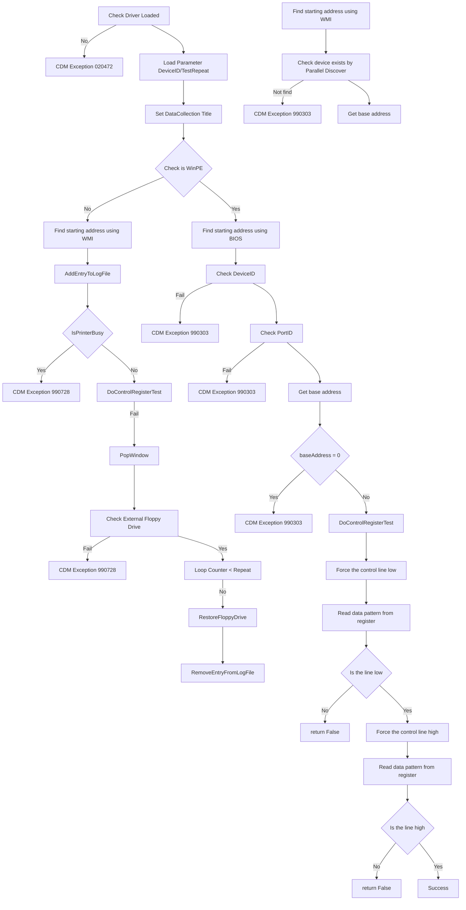

# Test Flowchart

```mermaid
flowchart TD

    A[Check Driver Loaded] -- No --> B[CDM Exception 020472]
    A --> C[Load Parameter DeviceID/TestRepeat]
    C --> D[Set DataCollection Title]
    D --> E{Check is WinPE}
    E -- No --> F[Find starting address using WMI]
    F --> G[AddEntryToLogFile]
    G --> H{IsPrinterBusy}
    H -- Yes --> I[CDM Exception 990728]
    H -- No --> J[DoControlRegisterTest]
    J -- Fail --> K[PopWindow]
    K --> L[Check External Floppy Drive]
    L -- Fail --> M[CDM Exception 990728]
    L -- Yes --> N[Loop Counter < Repeat]
    N -- No --> O[RestoreFloppyDrive]
    O --> P[RemoveEntryFromLogFile]

    E -- Yes --> Q[Find starting address using BIOS]

    %% Right Side Tree
    Q --> R[Check DeviceID]
    R -- Fail --> S[CDM Exception 990303]
    R --> T[Check PortID]
    T -- Fail --> U[CDM Exception 990303]
    T --> V[Get base address]
    V --> W{baseAddress = 0}
    W -- Yes --> X[CDM Exception 990303]
    W -- No --> Y[DoControlRegisterTest]

    %% Far Right Side
    AA[Find starting address using WMI] --> AB[Check device exists by Parallel Discover]
    AB -- Not find --> AC[CDM Exception 990303]
    AB --> AD[Get base address]

    %% DoControlRegisterTest block
    Y --> Z[Force the control line low]
    Z --> ZA[Read data pattern from register]
    ZA --> ZB{Is the line low}
    ZB -- No --> ZC[return False]
    ZB -- Yes --> ZD[Force the control line high]
    ZD --> ZE[Read data pattern from register]
    ZE --> ZF{Is the line high}
    ZF -- No --> ZG[return False]
    ZF -- Yes --> ZH[Success]
```

