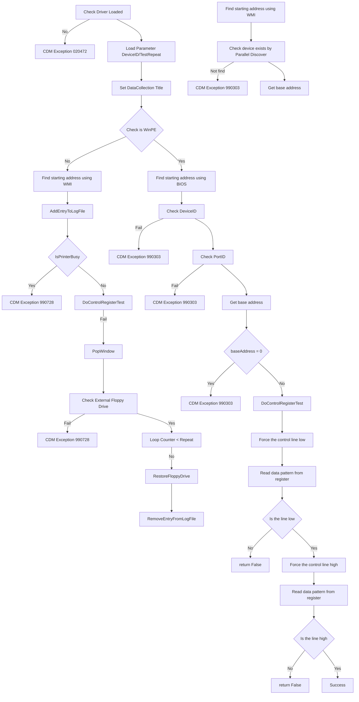

# Serial Diagnostic Specification

### Table of Contents

- [Serial Diagnostic Specification](#serial-diagnostic-specification)
  - [Table of Contents](#table-of-contents)
  - [Description](#description)
  - [External Equipment](#external-equipment)
  - [Command Line](#command-line)
  - [External LoopBack Test](#external-loopback-test)
    - [Description](#description-1)
    - [Command Line](#command-line-1)
    - [Test Operations](#test-operations)
    - [Test Lists](#test-lists)
    - [TestIniFile](#testinifile)
    - [Troubleshooting](#troubleshooting)

### Description

**Serial Diagnostic** is a tool used to verify proper operation of the serial ports (COM1, COM2, etc.) of a Unit Under Test (UUT). The diagnostic is CDM V2 compliant and used to check pin states, communication (transmit/receive), and user-visible indicators for hardware manufacture and validation.

### External Equipment

- **External loopback connector** (DB-9 female connector; one of Type1, Type2, or Type3 as required by configuration)
- Test-specific loopback devices

### Command Line

serial-diags-n.exe -parameter=value

**Parameters:**

- `subtest=<string>`
  - The name of the test to run. (**Mandatory**)
- `locale=<string>`
  - Language for the test. (**Default:** en_US)
- `help=<bool>`
  - Shows all supported command line arguments and exits. (**Default:** false)
- `description=<bool>`
  - Shows a brief description of the test and exits. (**Default:** false)
- `debug=<bool>`
  - Enables localized debug output, not for Vision Test framework. (**Default:** false)
- `catalog=<bool>`
  - Shows subtest parameters and details; does not run the test. (**Default:** false)
- `integratormsgfile=<string>`
  - Path to custom message file for prompt overrides. (**Default:** empty)
- `DataCollectionFile=<string>`
  - Write retry and errorcode info to this file. (**Default:** empty)
- `PromptPollMode=<bool>`
  - If true, "Prompt" popup only shows if loopback is not attached. (**Default:** true)
- `PromptText=<string>`
  - Custom text for prompt popup. (**Default:** "NA")

---

## External LoopBack Test

### Description

**External LoopBack Test** checks whether the pins on the serial port are functioning by asserting and de-asserting pins and reading corresponding pin states via a connected loopback device. A transmit/receive test confirms full data signal pathways. The test can also prompt the user to check the LED state on the loopback hardware.

### Command Line

**Minimum Required Command:**
serial-diags-n.exe -subtest=ExternalLoopBackTest -DeviceID=COM1

**Parameters:**

- `subtest=<ExternalLoopBackTest>`
  - The name of the test to run.
- `DeviceID=<COM port>`
  - The COM port under test (e.g., COM1, COM2). One port per command.
- `Retries=<int>`
  - Number of times to retry if test fails. (**Default:** 1)
- `TestIniFile=<string>`
  - Controls testlist and loopback type for each port, also defines popup pictures.
- `DataCollectionFile=<string>`
  - Write retry and errorcode info to this file.
- `PromptPollMode=<True/False>`
  - If true, "Prompt" will pop up unless loopback is attached. (**Default:** true)
- `PromptText=<string>`
  - Override the popup prompt. (**Default:** "NA")

**Example:**
serial-diags-n.exe -subtest=ExternalLoopbackTest -DeviceID=COM1 -Retries=3 -TestIniFile="./serial-diags-n.ini" -integratormsgfile="./serial-diags-n.msg"

This command runs the ExternalLoopbackTest on COM1, retries up to three times on failure, and uses the specified .ini file for configuration and prompts[1].

### Test Operations

- **DeAssertDataTerminalReady:** Set Data Terminal Ready pin to false.
- **AssertDataTerminalReady:** Set Data Terminal Ready pin to true.
- **DeAssertReadyToSend:** Set Ready To Send pin to false.
- **AssertReadyToSend:** Set Ready To Send pin to true.
- **ExpectDataCarrierDetectedIsTrue:** Read Data Carrier Detected pin; fail if false.
- **ExpectDataCarrierDetectedIsFalse:** Read Data Carrier Detected pin; fail if true.
- **ExpectDataSetReadyIsTrue:** Read Data Set Ready pin; fail if false.
- **ExpectDataSetReadyIsFalse:** Read Data Set Ready pin; fail if true.
- **ExpectClearToSendIsTrue:** Read Clear To Send pin; fail if false.
- **ExpectClearToSendIsFalse:** Read Clear To Send pin; fail if true.
- **TransmitAndReceiveTest:** Transmit and receive data, and compare.
- **ExpectGreenLEDOff/On:** Prompt user for Green LED state.
- **ExpectRedLEDOff/On:** Prompt user for Red LED state[1].

### Test Lists

Below operations are grouped into the following test lists:

| TestList  | Included Steps                                                                                                                                                                                                                                                                                                    |
| --------- | ----------------------------------------------------------------------------------------------------------------------------------------------------------------------------------------------------------------------------------------------------------------------------------------------------------------- |
| TestList1 | DeAssertDataTerminalReady DeAssertReadyToSend ExpectDataCarrierDetectedIsFalse ExpectDataSetReadyIsFalse ExpectClearToSendIsFalse AssertDataTerminalReady ExpectDataCarrierDetectedIsTrue ExpectDataSetReadyIsTrue AssertReadyToSend ExpectClearToSendIsTrue TransmitAndReceiveTest |
| TestList2 | ExpectGreenLEDOn ExpectRedLEDOff DeAssertDataTerminalReady DeAssertReadyToSend ExpectDataSetReadyIsFalse ExpectClearToSendIsFalse AssertDataTerminalReady ExpectDataSetReadyIsTrue AssertReadyToSend ExpectClearToSendIsTrue TransmitAndReceiveTest                                 |
| TestList3 | ExpectGreenLEDOn TransmitAndReceiveTest                                                                                                                                                                                                                                                                        |
| TestList4 | TransmitAndReceiveTest                                                                                                                                                                                                                                                                                            |

### TestIniFile

- Sections are divided by SSID of SUT.
- Popups can include device pictures as specified in .ini.
- Tests and loopback device assigned per DeviceID and (e.g.) BIOS config (RS-232/TTL), determined via WMI.
- Example:

com2.RS-232.TestList=TestList2
com2.RS-232.LoopbackType=Type2

- Future hardware may use additional attributes as needed[1].

### Troubleshooting

**Typical Error Codes and Remedies:**

- **Pin state failures:** Ensure loopback connector is inserted correctly.
- **Transmit/Receive failures:** Confirm port is available and not used by another application.
- **LED state errors:** Check loopback device and visually confirm LED state.
- **Prompt popups not behaving as expected:** Set `PromptPollMode` accordingly in configuration.

---
# Test Flowchart

